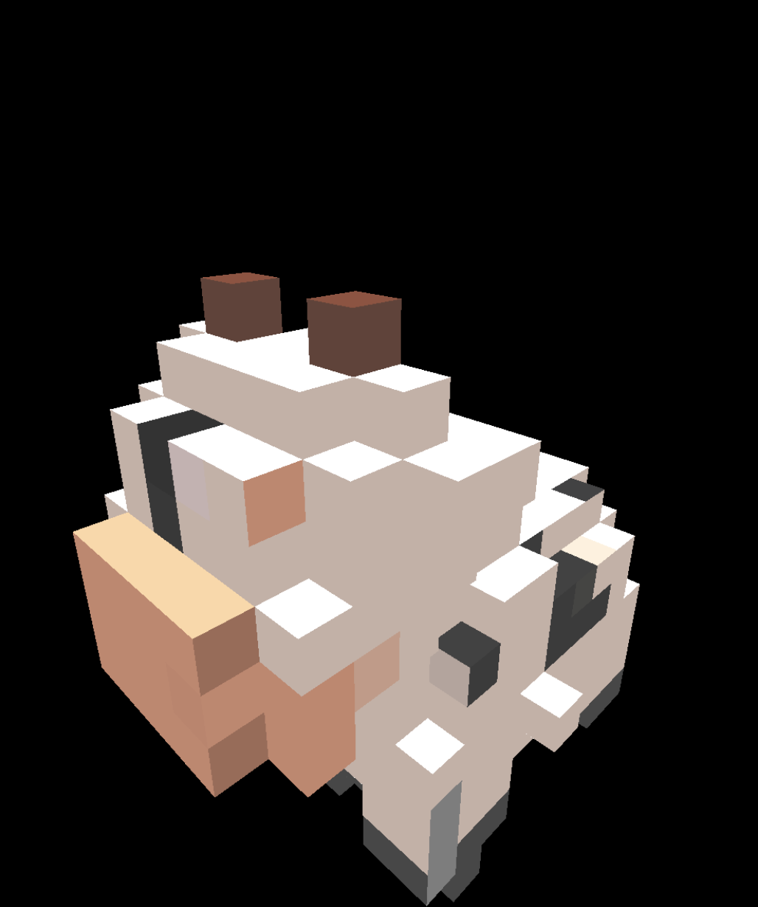
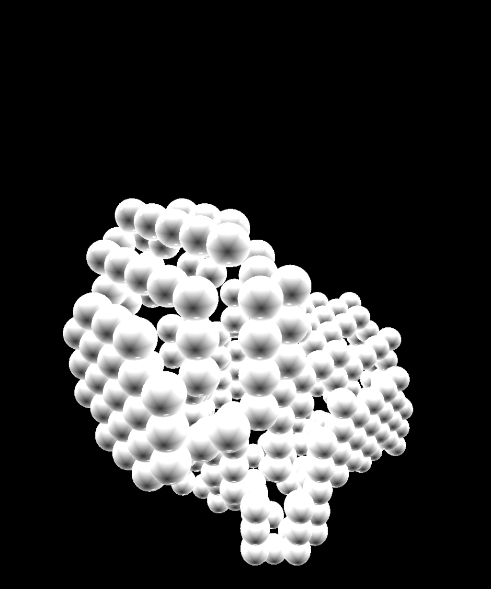
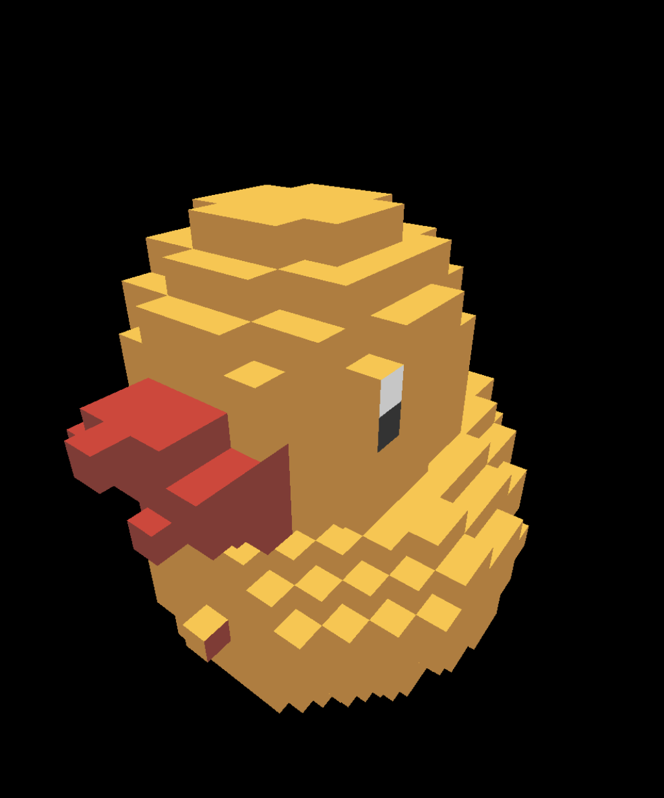

# Voxcell
A Framework for iOS and macOS to generate voxel, convex hull, etc. from MDLMesh

<a href="figs/moo_org.PNG" ></a>
<a href="figs/moo_voxel_01.PNG" ></a>
<a href="figs/moo_voxel_02.PNG" ></a>
<a href="figs/moo_voxel_03.PNG" ></a>
<a href="figs/moo_voxel_04.PNG" ></a>
<a href="figs/moo_voxel_05.PNG" ></a>
<a href="figs/moo_voxel_06.PNG" ></a>

<a href="figs/moo_ch.PNG" ></a>
<a href="figs/moo_obb.PNG" ></a>
<a href="figs/moo_inertia.PNG" ></a>
<a href="figs/moo_balls_01.PNG" ></a>
<a href="figs/moo_balls_02.PNG" ></a>
<a href="figs/moo_balls_03.PNG" ></a>
<a href="figs/moo_balls_04.PNG" ></a>

<a href="figs/quack_org.PNG" ></a>
<a href="figs/quack_voxel_01.PNG" ></a>
<a href="figs/quack_voxel_02.PNG" ></a>
<a href="figs/quack_voxel_03.PNG" ></a>
<a href="figs/quack_voxel_04.PNG" ></a>
<a href="figs/quack_voxel_05.PNG" ></a>
<a href="figs/quack_voxel_06.PNG" ></a>

<a href="figs/quack_ch.PNG" ></a>
<a href="figs/quack_obb.PNG" ></a>
<a href="figs/quack_inertia.PNG" ></a>
<a href="figs/quack_balls_01.PNG" ></a>
<a href="figs/quack_balls_02.PNG" ></a>
<a href="figs/quack_balls_03.PNG" ></a>
<a href="figs/quack_balls_04.PNG" ></a>

[Demo Video](https://youtu.be/VEKGdyVggcU)

## Input

* MDLMesh that contains the 3D object
* Optional MTLTexture to sample colors

## Output

* MDLMesh that represents voxelized object (optionally with sampled colors)
* Collision Balls for GPU-based collision detection
* 3D Volume bitmap, where true bits represent the boundary or the inside of the sampled object.
* Mass, center of mass, and the inertia tensor based on the sampled volume.
* Convex hull in the real Brep (graph embedding with vertices, edges, and faces)
* Optimum oriented bounding box in terms of volume.

## Supported devices
It should work for the recent Macs, iPhones, and iPads.
It's been tested with the following devices and the tool chain.

* Mac mini(M1, 2020) macOS Monterey 12.3.1
* MacBook Pro (Intel, 13-inch, 2017) macOS Monterey 12.3.1
* iPhone 13 mini iOS 15.4.1
* Xcode 13.3.1 (13E500a)


## Dependencies

* Accelerate.framework
* Metal.framework
* MetalPerformanceShaders.framework

## Build XCFramework
```
$ cd /path/to/your/repo/Voxcell/Voxcell

$ ls #Check if you are in the right directory
Voxcell Voxcell.xcodeproj VoxcellTests module.modulemap

$ xcodebuild archive -scheme Voxcell -configuration Release -destination 'generic/platform=iOS' -archivePath './build/Voxcell.framework-iphoneos.xcarchive' SKIP_INSTALL=NO BUILD_LIBRARIES_FOR_DISTRIBUTION=YES

$ xcodebuild archive -scheme Voxcell -configuration Release -destination 'generic/platform=iOS Simulator' -archivePath './build/Voxcell.framework-iphonesimulator.xcarchive' SKIP_INSTALL=NO BUILD_LIBRARIES_FOR_DISTRIBUTION=YES

$ xcodebuild archive -scheme Voxcell -configuration Release -sdk macosx -archivePath './build/Voxcell.framework-macos.xcarchive' SKIP_INSTALL=NO BUILD_LIBRARIES_FOR_DISTRIBUTION=YES

$ xcodebuild -create-xcframework -framework './build/Voxcell.framework-iphoneos.xcarchive/Products/Library/Frameworks/Voxcell.framework' -framework './build/Voxcell.framework-iphonesimulator.xcarchive/Products/Library/Frameworks/Voxcell.framework' -framework './build/Voxcell.framework-macos.xcarchive/Products/Library/Frameworks/Voxcell.framework' -output './build/Voxcell.xcframework'
```

(Run `sudo xcode-select -s /Applications/Xcode.app/Contents/Developer` first, if it's not selected yet.)

This will create a XCFramework in `./build/Voxcell.xcframework`.

## Usage

API Documentation is found at the bottom of this document.

### Table Of Contents

- [Overview](#overview)
- [VolumeSampler](#volumesampler)
  - [init](#constructor)
  - [Property gridInfo:GridInfo?](#property-gridinfogridinfo)
  - [Property volumeBitmap: VolumeBitmap?](#property-volumebitmap-volumebitmap)
    - [Function isSet()](#isset)
    - [Function isNotSet()](#isnotset)
  - [Function generateMDLMesh()](#function-generatemdlmesh)
    - [Default Vertex Descriptor](#default-vertex-descriptor)
    - [Default Material](#default-material)
  - [Function shrinkByHalfStep()](#function-shrinkbyhalfstep)
  - [Function findShell()](#function-findshell)
  - [Function findShellCenterPoints()](#function-findshellcenterpoints)
  - [Function findMass()](#function-findmass)
  - [Function findCenterOfMass()](#function-findcenterofmass)
  - [Function findInertiaTensor()](#function-findinertiatensor)
- [GridInfo](#gridinfo)
- [Brep](#brep)
  - [Function generateMDLMesh()](#function-generatemdlmesh-1)
  - [Static Function findConvexHull()](#static-function-findconvexhull)
  - [Static Function findOrientedBoundingBox()](#static-function-findorientedboundingbox)


## Running the accompanying demo App.
Open `/path/to/your/repo/Voxcell/VoxcellDemo/VoxcellDemo.xcodeproj`, build and run for macOS and iOS.

<a href="figs/ios_app_01.PNG"></a>
<a href="figs/ios_app_02.PNG"></a>

<a href="figs/macos_app_01.PNG"></a>


**NOTE:**

The 3D model duck is removed from this repo, as its license prohibits distribution in any readable form.

The 3D model cow is provided by [Keenan Crane](https://www.cs.cmu.edu/~kmcrane/Projects/ModelRepository/) under CC0. 1.0.

## Technical Stuff

### Depth Peeling in Metal
The volume sampling is done by a technique called 'depth peeling'. In OpenGL it is implemented using two Z-buffers alternatingly, which enable a function 'closest object but that muss be further than X' per pixel. This can not be implemented in Metal. However Metal has a nice ray-intersector, which can be used for depth peeling.
Please see 
[VolumeSampler/DepthPeeler.swift](Voxcell/Voxcell/VolumeSampler/DepthPeeler.swift) and
[VolumeSampler/DepthPeelerShaders.metal](Voxcell/Voxcell/VolumeSampler/DepthPeelerShaders.metal).

### Finding Convex Hull.
The implementation is taken from my existing C++ codebase for computational geometry and graph algorithms.
The algorithm is based on 
 *Computational Geometry Algorithms and Applications*,
 M. de Berg, M. van Kreveld, M. Overmars, and O.Schwartzkopf
 2nd Ed, Springer 2000, ISBN 3-540-65620-0.
Please see [CppCode/manifold_convex_hull.cpp](Voxcell/Voxcell/CppCode/manifold_convex_hull.cpp).


### Notes on how to build an Apple framework that contains both Swift and C++ code.

Ref: [Boris Gromov's Gist](https://gist.github.com/bgromov/f4327343ad67a5f7216262ccbe99c376)

1. Arrange an adapter class in Obj-c for each C++ class.

( Ex.
```
@implementation ManifoldObjc
...
-(void) findConvexHullOrOrientedBoundingBox:(const simd_float3 *const) points
                                  numPoints:(const int) numPoints
                     forOrientedBoundingBox:(const bool) orientedBoundingBox
{
    ...
    Manifold convex_hull;
    ...
    convex_hull.findConvexHull(vec, pred);
    ...
}
```
in [SwiftObjcCppInterface/manifold_objc.{h,mm}](Voxcell/Voxcell/SwiftObjcCppInterface/manifold_objc.mm) )

2. DO NOT create a bridging header file

3. Arrange an adapter class in Swift for Obj-c class

( Ex.
```
extension Brep {
    ...
    let mObjc : ManifoldObjc = ManifoldObjc()
    ...
}
``` 
in [BrepConvexHullExtension.swift](Voxcell/Voxcell/Brep/BrepConvexHullExtension.swift) )

4. Set all the Obj-c header files to Target Membership 'Public'

(Ex.
```
objects = {
    EF6E0C9E28233B5D00E5D6BC /* manifold_objc.h in Headers */ = {isa = PBXBuildFile; fileRef = EF6E0C9A28233B5D00E5D6BC /* manifold_objc.h */; settings = {ATTRIBUTES = (Public, ); }; };
}
```
in  [./Voxcell.xcodeproj/project.pbxproj](Voxcell/Voxcell.xcodeproj/project.pbxproj)

5. Place the Obj-c header filenames under the module definiton file. (Ex. [module.modulemap](Voxcell/module.modulemap) )

6. TARGETS -> Packaging -> Module Map File = module.modulemap (Ex. `buildSettings = {MODULEMAP_FILE = module.modulemap;}` in in  [./Voxcell.xcodeproj/project.pbxproj](Voxcell/Voxcell.xcodeproj/project.pbxproj) )


## License

GPL v3.

Commercial use with proper attribution can be considered.

Especially, for indy developers and small businesses, a very favorable licensing can be readily arranged.

## Contact

For technical and commercial inquiries, please contact: Shoichiro Yamanishi

yamanishi72@gmail.com


# API Guide

## Overview
The Voxcell Framework consists of two main classes: `VolumeSampler` and `Brep`.

## VolumeSampler
`VolumeSampler` samples the volume represented by the given MDLMesh using the depth peeling technique.
It generates a 3D volume bitmap, which is used to generate a voxelized mesh, collision balls, mass, the center of mass, and the inertia tensor.
The constructor takes the MDLMesh and other attributes, and generates a 3D volume bitmap internally.
Other member functions generate other representations based on the bitmap.

### Constructor
It takes the MDLMesh and associated attributes, and generates a 3D volume bitmap to its public member property `volumeBitmap`.
```
    public init(
        device:            MTLDevice,
        useExternalShader: Bool,
        mdlMesh:           MDLMesh,
        texture:           MTLTexture?,
        defaultColor:      SIMD3<Float>?,
        pitch:             Float,
        epsilon:           Float
    ) {
```

- `device:` Metal device
- `useExternalShader:` Default is False. Set it to true for debugging.
Internally, if this is set to false, the shader code hardcoded in `DepthPeelerShadersString.swift` is compiled at runtime.
If this is set to true, then the shader functions are searched from the system's default library. You can copy DepthPeelerShadersTypes.{h,metal} to your app's default Bundle.
- `mdlMesh`: The 3D model to be scanned
- `texture:` Associated color texture for the 3D model (optional). Usually the color texture is specified in the `map_Kd` attribute in the MTL file associated to the OBJ file.
- `defaultColor:` Color used if the texture is not given (optional)
- `pitch:` The grid pitch of the isometric 3D grid in which the 3D models is scanned. Please be careful not to make this value small. For example, if the extent (W/H/D) of the model's coordinates is (10.0/10.0/10.0) and if pitch is set to 0.001, then it will try to make a bitmap of dimension (10000 x 10000 x 10000). The size of the bitmap would be 125 GB, which is way beyond the managable range.
- `epsilon:` Perturbation added when the ray position is updated in the shader for the next peeling to avoid detecting the same intersection again due to numerical errors.

**Example**

```
import Voxcell

let volumeSampler = VolumeSampler(
    device:            device,
    useExternalShader: false,
    mdlMesh:           mdlMeshFromMDLAsset,
    texture:           texture,
    defaultColor:      SIMD3<Float>( 0.8, 0.8, 0.8 ),
    pitch:             0.1,
    epsilon:           0.0001 )
```

### Property `gridInfo:GridInfo?`
The grid information used for the volume sampling.

**Example**

```
volumeSampler.gridInfo
```

### Property `volumeBitmap: VolumeBitmap?`
The sampled 3D volume bitmap. True indicates that the cell contains the boundary of the object, or enclosed inside of the object. False indicates that the cell is outside of the object.
Two operations are available

#### isSet()
```
    public func isSet( x: Int, y: Int, z: Int ) -> Bool
```
Returns true if the bit for the given integer coordinate is set.

- parameter x: integer x-coordinate
- parameter y: integer y-coordinate
- parameter z: integer z-coordinate
- returns true if the bit is set.


#### isNotSet()
```
    public func isNotSet( x: Int, y: Int, z: Int ) -> Bool
```
Returns false if the bit for the given integer coordinate is set.

- parameter x: integer x-coordinate
- parameter y: integer y-coordinate
- parameter z: integer z-coordinate
- returns true if the bit is set.

**Example**
```
let zeroPos: Bool = volumeSampler.volumeBitmap!.isSet( x: 0, y: 0, z: 0 )
```

### Function `generateMDLMesh()`
Generates MDLMesh of the voxelized object in a composition of quads.

- parameter `vertexDescriptor:` Vertex descriptor to describe the memory layouts(optional)
- parameter `material:` Material used for MDLSubmeshes in MDLMesh(optional)
- parameter `useTextureColors:` Set it to True, if you want to use the sampled colors from the texture. False, if you want to use the color specified in material, or the default color specified to the constructor.
- returns MDLMesh generated

```
    public func generateMDLMesh(

        vertexDescriptor: MDLVertexDescriptor?,
        material:         MDLMaterial?,
        useTextureColors: Bool

    ) -> MDLMesh?
```

#### Default Vertex Descriptor
If vertexDescriptor is not specified, the following descriptor is used.
For the other variations, please see [Voxcell/Modeling/RenderUtil.swift](Voxcell/Voxcell/Modeling/RenderUtil.swift)
```
    static func defaultVertexDescriptorPositionNormalColor() -> MDLVertexDescriptor {
        let layout0 = MDLVertexBufferLayout()
        layout0.stride =   MemoryLayout<SIMD3<Float>>.stride
                         + MemoryLayout<SIMD3<Float>>.stride
                         + MemoryLayout<SIMD3<Float>>.stride

        let attribute0         = MDLVertexAttribute()
        attribute0.name        = MDLVertexAttributePosition
        attribute0.format      = MDLVertexFormat.float3
        attribute0.bufferIndex = 0
        attribute0.offset      = 0

        let attribute1         = MDLVertexAttribute()
        attribute1.name        = MDLVertexAttributeNormal
        attribute1.format      = MDLVertexFormat.float3
        attribute1.bufferIndex = 0
        attribute1.offset      = MemoryLayout<SIMD3<Float>>.stride

        let attribute2         = MDLVertexAttribute()
        attribute2.name        = MDLVertexAttributeColor
        attribute2.format      = MDLVertexFormat.float3
        attribute2.bufferIndex = 0
        attribute2.offset      = MemoryLayout<SIMD3<Float>>.stride + MemoryLayout<SIMD3<Float>>.stride

        let vertexDescriptor = MDLVertexDescriptor()
        vertexDescriptor.layouts    = [ layout0 ]
        vertexDescriptor.attributes = [ attribute0, attribute1, attribute2 ]
    }
```

#### Default Material
If material is not specified, the following is used.
Please see [Voxcell/Modeling/RenderUtil.swift](Voxcell/Voxcell/Modeling/RenderUtil.swift)
The color is taken from the default color specified to the constructor of `VolumeSampler`.
```
    static func defaultMaterial( color: SIMD3<Float> ) -> MDLMaterial {

        let scatteringFunction = MDLScatteringFunction()
        let material = MDLMaterial( name: "Brep", scatteringFunction: scatteringFunction )

        material.setProperty( MDLMaterialProperty(
                                  name:     "baseColor",
                                  semantic: .baseColor,
                                  float3:   color
                            ) )

        material.setProperty( MDLMaterialProperty(
                                  name:     "specular",
                                  semantic: .specular,
                                  float3:   vector_float3( 0.8, 0.8 ,0.8 )
                            ) )

        material.setProperty( MDLMaterialProperty(
                                  name:     "specularComponent",
                                  semantic: .specularExponent ,
                                  float:    255.0
                            ) )

        material.setProperty( MDLMaterialProperty(
                                  name:     "opacity",
                                  semantic: .opacity ,
                                  float:    0.2
                            ) )
        return material
    }

```

### Function `shrinkByHalfStep()`
```
    public func shrinkByHalfStep() -> Void
```
Shrinks the size of the grid by one grid pitch along all the three axes.

Assume the current extent in the x-axis is `[-3.0, 5.0]` and the pitch is `1.0`.
The number of cells along the x-axis  (dimension of x) is 8, and the range of the corresponding integer coordinates is `[0, 8]`. After the shrinking,
The extent will be `[-2.5, 4.5]`, and the dimension becomes `7` and the integer range becomes `[0,7]` The pitch does not change.

Conceptually, the points that corresponded to the vertices of the cubes become center point of the cubes in the new shrunk grid.
The bit in the new grid is set if more than or equal to 4 bits in the 8 surrounding cells are set (except for the boundary cells).

For example the bit at the integer coordinate `[3,4,5]` in the new grid is set if more than or equal to 4 bits in the following 8 integer coordinates in the old grid are set:

    `[3,4,5], [4,4,5], [3,5,5], [4,5,5], [3,4,6], [4,4,6], [3,5,6], [4,5,6]`

This can be useful for collision detectors where it is desirable for the collision spheres to be nearly fully inside the original 3D object.


### Function `findShell()`
```
    public func findShell() -> [SIMD3<Int32>] 
```
Finds the integer coordinates of the cells that are at the boundary of the voxelized volume.
A cell is at the boundary if not all of its 6 orthogonally adjacent cells are set.

- returns array of integer coordinates in the grid.


### Function `findShellCenterPoints()`
```
    public func findShellCenterPoints() -> [SIMD3<Float>]
```
Finds the 3D spatial coordinates of the center point of the cells that are at the boundary of the voxelized volume.
This is useful for generating collision spheres of the 3D object for collision detection.
A cell is at the boundary if not all of its 6 orthogonally adjacent cells are set.

- returns array of geometric coordinates in the grid.


### Function `findMass()`
```
    public func findMass( densityPerUnitVolume: Float ) -> Float
```
Finds the total mass by sampling based on the volume represented by the bitmap.

- parameter densityPerUnitVolume
- returns Mass

### Function `findCenterOfMass()`
```
    public func findCenterOfMass() -> SIMD3<Float>
```
Finds the center of mass by sampling based on the volume represented by the bitmap.

- returns CoM in the 3D spatial coordinates.

### Function `findInertiaTensor()`
```
    public func findInertiaTensor( densityPerUnitVolume density: Float ) -> float3x3
```
Finds the 3x3 inertia tensor by sampling based on the volume represented by the bitmap.

- returns intertia tensor

## GridInfo
Represents the geometric information of the grid.
It uses to coordinate system, integer corrdinate system `[i,j,k]` in `Int` and the spatial coordinate system `(x,y,z)` in `Float`.
`[0,0,0]` coresponds to `extentMin` and` [dimension.x, dimension.y, dimension.z]` corresponds to `extentMax`. `extentMax - extentMin` is a multiple of `pitch`, and the multipliers are `dimensions`, i.e., `extentMax.x - extentMin.x = pitch * dimension.x`.

```
    public let extentMin: SIMD3<Float>
    public let extentMax: SIMD3<Float>
    public let dimension: SIMD3<Int>
    public let pitch: Float

```

##  Brep
'Brep' represents a closed boundary of piese-wise linear 3D objects in a planar graph embedding.

Please see [Voxcell/Brep/Brep.swift](../Brep/Brep.swift).

It consists of the following three lists as properties.
```
    public var vertices  = OwnerList()
    public var halfEdges = OwnerList()
    public var faces     = OwnerList()
```
The definitions of the three features are as follows.
```
public class Vertex : ListElem {

    public var outgoingHalfEdges = WeakList1()
    
    public var point = SIMD3<Float>(0,0,0)
    
    init(_ v : SIMD3<Float>) {
        point = v
    }
}

public class HalfEdge : ListElemWithWeakChain2 {

    public weak var src : Vertex?
    public weak var dst : Vertex?

    public weak var prevHalfEdge  : HalfEdge?
    public weak var nextHalfEdge  : HalfEdge?
    public weak var buddyHalfEdge : HalfEdge?

    public weak var face : Face?
}

public class Face : ListElem {

    public var halfEdges = WeakList2()

    public var normal    = SIMD3<Float>(0,0,0)
    public var tangent   = SIMD3<Float>(0,0,0)
    public var bitangent = SIMD3<Float>(0,0,0)

    public var textureCoordinates : [SIMD2<Float>]?
}
```

For the meaning of each feature and its properties, please see [Doubly connected edge list](https://en.wikipedia.org/wiki/Doubly_connected_edge_list).
It has the following member function to generate MDLMesh, and the two static functions are available to generate `Brep`.

### Function `generateMDLMesh()`
```
    public func generateMDLMesh(

        device:           MTLDevice,
        type:             MDLGeometryType,
        vertexDescriptor: MDLVertexDescriptor?,
        material:         MDLMaterial?,
        color:            SIMD3<Float>?
        
    ) -> MDLMesh?
```
Constructs a MDLMesh per MDLVertexDescriptor.

- parameter device:  The Metal device used
- parameter type:    geometry type. Any of `.triangles`, `.lines`, or `.points` **.lines and .points NOT YET SUPPORTED**
- parameter vertexDescriptor: spec for the buffer in layouts and attributes. If  nil, the following default values are used.
- parameter material: spec for the material properties. If nil, the following default values are used.
- parameter color: RGBA for the mesh to be generated. If the vertex descriptor contains an attribute `MDLVertexAttributeColor`, then this value is used.

 **Acceptable values for MDLVertexDescriptor**

*type == .triangles*
- `MDLVertexAttributePosition` (`float3` or `float4`) if `float4` is specified `w` is set to 1.
- `MDLVertexAttributeNormal` (`float3` or `float4`) if `float4` is specified `w` is set to 0.
- `MDLVertexAttributeTextureCoordinate` (`float2`)
- `MDLVertexAttributeTangent` (`float3` or `float4`) if `float4` is specified `w` is set to 0.
- `MDLVertexAttributeBitangent` (`float3` or `float4`) if `float4` is specified `w` is set to 0.
- `MDLVertexAttributeColor` (`float3` or `float4`) RGB or RGBA

*type == .lines or .points* **NOT YET SUPPORTED**

- `MDLVertexAttributePosition` (`float3` or `float4`) if `float4` is specified `w` is set to 1.
- `MDLVertexAttributeColor` (`float3` or `float4`) RGB or RGBA
- `MDLVertexAttributeTextureCoordinate` (`float2`)

**The default MDLVertexDescriptor**
```
layout[0].stride =   MemoryLayout<SIMD3<Float>>.stride // point
                   + MemoryLayout<SIMD3<Float>>.stride // normal
                   + MemoryLayout<SIMD4<Float>>.stride // color

attribute[0].name        = MDLVertexAttributePosition
attribute[0].format      = MDLVertexFormat.float3
attribute[0].bufferIndex = 0
attribute[0].offset      = 0

attribute[1].name        = MDLVertexAttributeNormal
attribute[1].format      = MDLVertexFormat.float3
attribute[1].bufferIndex = 1
attribute[1.]offset      = MemoryLayout<SIMD3<Float>>.stride

attribute[2].name        = MDLVertexAttributeColor
attribute[2].format      = MDLVertexFormat.float4
attribute[2].bufferIndex = 1
attribute[2.]offset      = MemoryLayout<SIMD3<Float>>.stride + MemoryLayout<SIMD3<Float>>.stride
```

**The default MDLMaterial**
```
scatteringFunction: MDLScatteringFunction()
name: 'Brep'
MDLMaterialProperty( name: "baseColor",         semantic: .baseColor,        float3: color or vector_float3(0.5, 0.5 ,0.5) )
MDLMaterialProperty( name: "specular",          semantic: .specular,         float3: vector_float3(0.8, 0.8 ,0.8) )
MDLMaterialProperty( name: "specularComponent", semantic: .specularExponent, float:  255.0) )
MDLMaterialProperty( name: "opacity",           semantic: .opacity,          float: 0.2) )
```

- returns: A MDLMesh of this Brep.

### Static Function `findConvexHull()`
```
    static public func findConvexHull( vertices : [ SIMD3<Float> ] ) -> Brep
```
Constructs a convex hull from the given list of points
please see [BrepConvexHullExtension.swift](Voxcell/Voxcell/Brep/BrepConvexHullExtension.swift)


- Construction depends on the C++ implementation found in `manifold_convex_hull.cpp`
- If the given set of points does not form at least 3-simplex, it returns an empty Brep with no vertex, no faces, and no half-edges.
- Algorithm

    1. Peform the principal component analysis.
    2. Find the 2 extremal points along the primary axis, and other 2 extremal points along the secondary axis.
    3. Form an initial 3-simplex from the 4 points.
    4. For the rest of the points, incrementally test each point according to *Clarkson & Shor* algorithm described in *de Berg, van Kreveld, Overmars, & Cheong(Schwarzkopf)*.

- parameter `vertices:` Array of points
- returns: A Brep that represents the convex hull.

- seealso : Ref1: K.L. Clarkson, P. W. Schor. Applications of random sampling in computational geometry II, Discrete Comput. Gem. 4: 387-421, 1989
- seealso : Ref2 : de Berg, Cheong, van Kreveld, & Overmars, Computational Geometry, Springer-Verlag, 2008, 978-3-540-77973-5

### Static Function `findOrientedBoundingBox()`
Constructs the optimum oriented bounding box from the given list of points
```
    static public func findOrientedBoundingBox( vertices : [ SIMD3<Float> ] ) -> Brep
```

